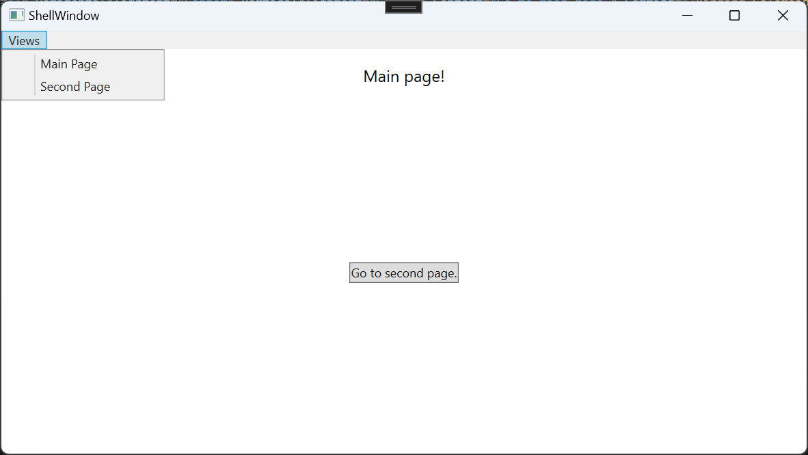
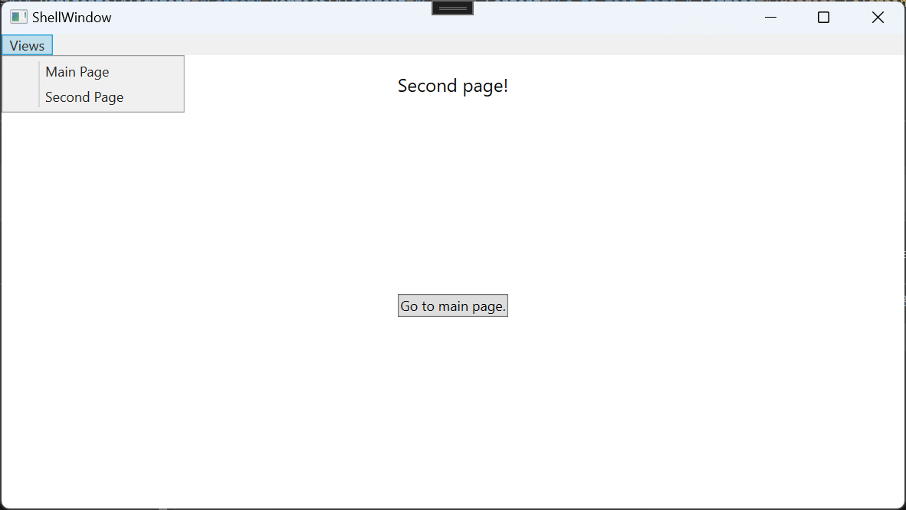

# WpfBase_Template &middot;  &middot; 

## Description 

This is a simple base template for WPF application with page navigation.

**
This template is just a simple base.
**

Although it's just a basic template, there are two sample pages included, making it an executable sample.

## Usage
1. Prepare your shell window (`ShellWindowView.xaml`) to fit your design wishes.
    1. Optionally, modify the view model.
2. Add and design your pages, optionally.
    1. Optionally, add view models.  (If you want your view models to be triggered when navigated to/from them, implement the `INavigationAware` interface).
3. Add page keys for your pages to `NavigationConstants.cs`.
4. Register services for pages and view models in `RegisterServices` function inside `App.xaml.cs`.
5. Register pages for navigation in `RegisterNavigation` function inside `App.xaml.cs`.
6. Set up your start page in `Initialize` funciton inside `AppHostService.cs`.

**
Feel free to reach out, if help is needed.
**

## Example screenshots

These screenshots show the example pages, included in the project. Navigation is possible via ShellWindow Menu or via Buttons on the pages.

 

## Ideas
* Add dialogs.
* ?
## Third Party Software / Packages
Please have a look at [THIRD-PARTY-LICENSES](./THIRD-PARTY-LICENSES.md) for all the awesome packages used in this template.

## License
This template is [MIT licensed](./LICENSE.txt).